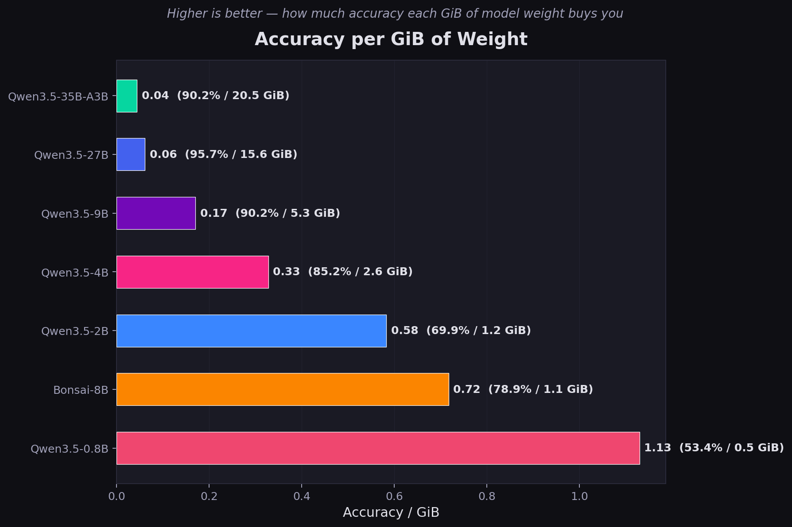

# Bonsai vs Qwen3.5, on Edge

> **Note:** This benchmark is a quick experiment to compare these models on a Jetson Orin, not a thorough or rigorous evaluation. Take the results as rough directional signals, not definitive rankings.

How good is the world's first 1-bit LLM? We pit [Bonsai-8B](https://prismml.com/news/bonsai-8b) against six Qwen3.5 variants (0.8B–27B) on an NVIDIA Jetson Orin, running 98 questions across 7 categories via [llama.cpp](https://github.com/ggml-org/llama.cpp).

## About Bonsai-8B

[Bonsai-8B](https://prismml.com/news/bonsai-8b) is the world's first commercially viable 1-bit LLM, developed by [PrismML](https://prismml.com/) — a startup that emerged from Caltech research with backing from Khosla Ventures, Cerberus, and Google. The entire network (embeddings, attention, MLP, LM head) is natively 1-bit, resulting in a 1.1 GiB model that is 14x smaller and 8x faster than a full-precision 8B model. It is released under the Apache 2.0 license. This benchmark tests how its aggressive quantization trades off against the Qwen3.5 family's conventional Q4_K_M quantization.

## Models

| Model | Params | Quant | Architecture | Weight Size |
|-------|-------:|-------|--------------|------------:|
| **Qwen3.5-35B-A3B** | 35.5 B (3B active) | Q4_K_M | MoE Hybrid SSM + Attention | 20.5 GiB |
| **Qwen3.5-27B** | 26.9 B | Q4_K_M | Hybrid SSM + SWA + Full Attention | 15.6 GiB |
| **Qwen3.5-9B** | 8.95 B | Q4_K_M | Hybrid SSM + Attention | 5.3 GiB |
| **Bonsai-8B** | 8.19 B | Q1_0 | Dense Transformer (Qwen3-8B 1-bit) | 1.1 GiB |
| **Qwen3.5-4B** | 4.21 B | Q4_K_M | Hybrid Gated DeltaNet + Attention | 2.6 GiB |
| **Qwen3.5-2B** | 1.89 B | Q4_K_M | Hybrid Gated DeltaNet + Attention | 1.2 GiB |
| **Qwen3.5-0.8B** | 0.82 B | Q4_K_S | Hybrid Gated DeltaNet + Attention | 485 MiB |

All models are served via `llama-server` behind systemd units with flash attention enabled and thinking/reasoning disabled. See the per-model docs for full server configs:
[Qwen3.5-27B](qwen3.5-27b-server.md) | [Qwen3.5-9B](qwen3.5-9b-server.md) | [Qwen3.5-4B](qwen3.5-4b-server.md) | [Bonsai-8B](bonsai-8b-server.md)

## Benchmark Design

**98 questions** across **7 categories** and **3 difficulty levels** (easy / medium / hard):

| Category | Questions | Scoring |
|----------|:---------:|---------|
| General Knowledge | 14 | Exact match, keyword |
| Mathematics | 14 | Exact match |
| Coding | 14 | Execution-graded (Python test harnesses) |
| History | 14 | Exact match, keyword |
| Logical Reasoning | 14 | Exact match, constraint verifiers |
| Language Understanding | 14 | Exact match, keyword |
| Persian | 14 | Exact match, keyword |

Each question is run **3 times** per model. Scores report the mean across runs. Coding questions are graded by executing the model's output against a test suite (partial credit for passing some tests).

**Scripts:**
- `llm_benchmark.py` — runs the benchmark (manages systemd services, queries models, scores responses)
- `benchmark_eda.py` — generates analysis plots from the CSV results

## Results

**Date:** 2026-04-01 | **llama.cpp build:** latest | **Device:** Jetson Orin 30 GB

### Summary


| Model | Accuracy | Gen tok/s | Prompt tok/s | Wall Time |
|-------|:--------:|:---------:|:------------:|:---------:|
| Qwen3.5-27B | **95.7%** | 9.5 | 107 | 444s |
| Qwen3.5-35B-A3B | 90.2% | 34.2 | 206 | 123s |
| Qwen3.5-9B | 90.2% | 27.0 | 320 | 167s |
| Qwen3.5-4B | 85.2% | 36.7 | 473 | 181s |
| Bonsai-8B | 78.9% | 46.5 | 554 | 117s |
| Qwen3.5-2B | 69.9% | 68.4 | 978 | 93s |
| Qwen3.5-0.8B | 53.4% | **100.9** | **1303** | **82s** |

### Overall Accuracy


Qwen3.5-27B leads at 95.7%. The 35B-A3B MoE model ties the dense 9B at 90.2% despite having 4x more total parameters — its 3B active param budget limits it. Below 4B, accuracy drops steeply: the 2B manages 69.9% and the 0.8B falls to 53.4%. Bonsai-8B's 1-bit quantization reaches 78.9%, outperforming the dense Qwen3.5-2B.

### Accuracy per GiB



When normalized by weight file size, the ranking inverts. Qwen3.5-0.8B leads at 1.13 accuracy/GiB — its 485 MiB footprint makes every byte count. Bonsai-8B (0.72) beats every Qwen model above 2B thanks to its 1.1 GiB file delivering 78.9% accuracy. The large models are the least efficient: Qwen3.5-35B-A3B gets only 0.04 accuracy/GiB — its 20.5 GiB of weights yield the same 90.2% that the 9B achieves from 5.3 GiB.

### Accuracy by Category


**Strong across larger models:** General Knowledge, Coding, History, Language Understanding.

**Biggest differentiators:**
- **Math** — the widest spread. Qwen3.5-27B scores a perfect 100%, the 35B-A3B and 9B are in the 81-86% range, but below that it collapses: Qwen3.5-2B scores 31% and the 0.8B just 11.9%.
- **Logical Reasoning** — the hardest category for top models. Even the 27B only reaches 80.8%. The smallest models struggle: 0.8B at 37.4%, 2B at 56.8%.
- **Persian** — Qwen3.5-27B (91.7%) vastly outperforms the smaller models. Multilingual capability degrades sharply below 9B.
- **Coding** — surprisingly robust: Bonsai-8B scores 100%, and even the 0.8B manages 44%. Code generation survives quantization better than reasoning.

### Accuracy by Difficulty


The top four models handle easy questions well (>90%). Hard questions expose the gap: Qwen3.5-27B stays above 90%, Bonsai-8B drops to ~73%, and the 0.8B falls to ~55%.

### Accuracy vs. Speed


The classic accuracy-throughput tradeoff. Qwen3.5-0.8B is the fastest at 100.9 tok/s but sacrifices 42 points of accuracy vs. the 27B. The 35B-A3B MoE is a surprise: 34 tok/s (faster than the dense 9B at 27 tok/s) with the same 90.2% accuracy — its sparse activation pays off in throughput. Qwen3.5-9B remains a practical sweet spot for dense models: 90.2% accuracy at 27 tok/s.

### Speed Comparison


Generation speed is dominated by memory bandwidth on the Jetson's unified memory architecture. Smaller weight footprint = faster generation. Qwen3.5-0.8B leads at 100.9 tok/s with its tiny 485 MiB footprint, followed by the 2B at 68.4 tok/s. Bonsai-8B's 1-bit weights (1.1 GiB) make it faster than the 2.4x-heavier Qwen3.5-4B (2.6 GiB). The 35B-A3B MoE achieves 34 tok/s despite its 20.5 GiB file — only 3B params are active per token.

### Performance Details


### Scaling Analysis


### Question-Level Analysis


### Hardest Questions


The hardest questions across all models are logic constraint puzzles (card ordering, clock angles, race ordering) and Persian language tasks. These require precise multi-step reasoning or strong multilingual knowledge — areas where smaller/more-quantized models struggle most. With 7 models, the spread is wider: questions that the 27B aces but the 0.8B gets wrong reveal the minimum model capacity required for each task.

### Verbosity


## Key Takeaways

1. **Qwen3.5-27B is the accuracy leader** at 95.7%, but at 9.5 tok/s it's the slowest. Best for tasks where correctness matters more than latency.

2. **Qwen3.5-35B-A3B ties the 9B at 90.2% but is faster** — 34 tok/s vs. 27 tok/s. The MoE architecture (3B active out of 35.5B total) trades weight file size (20.5 GiB) for throughput. Good if you have the disk/memory but want speed with high accuracy.

3. **Qwen3.5-9B is the best dense all-rounder** — 90.2% accuracy at 27 tok/s from 5.3 GiB. Handles most categories well with the notable exception of logical reasoning.

4. **Qwen3.5-4B punches above its weight** — 85.2% accuracy from only 2.6 GiB of weights. The hybrid Gated DeltaNet architecture keeps it competitive.

5. **Bonsai-8B trades accuracy for speed** — 1-bit quantization delivers 46.5 tok/s but costs 17 points of accuracy vs. the 27B. Still outperforms the dense Qwen3.5-2B despite radical compression.

6. **Sub-2B models struggle on reasoning and math** — Qwen3.5-2B drops to 31% on math and 57% on logic. The 0.8B collapses to 12% on math and 37% on logic. These are usable only for simple factual or conversational tasks.

7. **Coding survives compression best** — Bonsai-8B scores 100%, and even larger Qwen models are 89%+. The 0.8B still manages 44%. Code generation is the most quantization-resilient capability.

8. **Persian and multilingual degrade sharply below 9B** — the 27B→0.8B gap is 36 percentage points on Persian vs. 30 on General Knowledge. Multilingual capability requires parameter mass.

9. **Speed scales inversely with active parameters** — from 9.5 tok/s (27B dense) to 100.9 tok/s (0.8B). The 35B-A3B MoE demonstrates that sparse activation is a viable path to high-throughput inference on memory-bandwidth-limited hardware.

## Bonsai-8B: Is 1-Bit Worth It?

Bonsai-8B fits in **1.1 GiB** — 14x smaller than Qwen3.5-27B (15.6 GiB), 5x smaller than Qwen3.5-9B (5.3 GiB), and less than half the size of Qwen3.5-4B (2.6 GiB). At 46.5 tok/s it's the third-fastest model tested (behind the 0.8B and 2B) and finishes the full 98-question benchmark in under 2 minutes. But those gains come at a real cost.

**Where Bonsai holds up well:**
- **Coding (100%)** — perfect score, matching or beating every Qwen model. That said, 100% on 14 questions doesn't make it a coding beast — it would need a dedicated coding benchmark to draw real conclusions. But for now, it's looking good.
- **General Knowledge (92.9%)** — only 7 points behind the 27B. Factual recall survives aggressive compression.
- **History (96.4%)** — near-perfect, on par with the Qwen family.

**Where it falls apart:**
- **Persian (51.2%)** — essentially a coin flip. The 27B scores 91.7% on the same questions. Multilingual capability is the first casualty of extreme quantization.
- **Logical Reasoning (55.9%)** — multi-step constraint puzzles and syllogisms require representational precision that 1-bit weights can't sustain.
- **Math (66.7%)** — the harder arithmetic and algebra problems expose the precision loss.

**The tradeoff in numbers:**

| | Qwen3.5-0.8B | Qwen3.5-2B | Bonsai-8B | Qwen3.5-4B | Qwen3.5-9B | Qwen3.5-35B-A3B | Qwen3.5-27B |
|---|:-:|:-:|:-:|:-:|:-:|:-:|:-:|
| Weight Size | 485 MiB | 1.2 GiB | **1.1 GiB** | 2.6 GiB | 5.3 GiB | 20.5 GiB | 15.6 GiB |
| Accuracy | 53.4% | 69.9% | 78.9% | 85.2% | 90.2% | 90.2% | 95.7% |
| Gen Speed | **100.9 tok/s** | 68.4 tok/s | 46.5 tok/s | 36.7 tok/s | 27.0 tok/s | 34.2 tok/s | 9.5 tok/s |

Bonsai-8B sits at a unique point in this lineup: at 1.1 GiB it's smaller than the Qwen3.5-2B (1.2 GiB) yet scores 9 points higher (78.9% vs. 69.9%). It proves that native 1-bit quantization can outperform a conventionally-quantized model with fewer total parameters. If you're running on a device where every megabyte of RAM counts and your workload is primarily English coding or factual Q&A, Bonsai is a compelling choice. But if your use case involves reasoning, math, or non-English languages, the 2.6 GiB Qwen3.5-4B is a better investment: 6 more accuracy points for just 1.5 GiB of additional weight.

**Bottom line:** Bonsai-8B proves that 1-bit models are viable for production use in constrained environments. It's not a toy — it holds its own on factual and coding tasks (though the latter needs more rigorous benchmarking to confirm). But it's a specialist, not a generalist. For multilingual or reasoning-heavy workloads, spend the extra memory on a Qwen3.5 variant.

## Running

```bash
# Run the full benchmark (all 7 models)
uv run llm_benchmark.py

# Run specific models only
uv run llm_benchmark.py qwen3.5-2b qwen3.5-0.8b qwen3.5-35b-a3b

# Generate analysis plots
uv run benchmark_eda.py
```

Requires passwordless sudo for `systemctl start/stop llama-server-*` (see `/etc/sudoers.d/llama-benchmark`).

## Hardware

- **Device:** NVIDIA Jetson Orin
- **Memory:** 30,696 MiB unified (shared CPU/GPU)
- **CPU:** 12 threads (ARM Cortex-A78AE)
- **GPU:** Ampere (compute capability 8.7)
- **Memory Bandwidth:** ~205 GB/s

## Author

Arman Jafarnezhad w/ Claude Opus 4.6 Max Effort
