# LLM Benchmark — Jetson Orin

> **Note:** This benchmark is a quick experiment to compare these models on a Jetson Orin, not a thorough or rigorous evaluation. Take the results as rough directional signals, not definitive rankings.

Accuracy and performance evaluation of quantized LLMs running locally on an NVIDIA Jetson Orin (30 GB unified memory) via [llama.cpp](https://github.com/ggml-org/llama.cpp).

## About Bonsai-8B

[Bonsai-8B](https://prismml.com/news/bonsai-8b) is the world's first commercially viable 1-bit LLM, developed by [PrismML](https://prismml.com/) — a startup that emerged from Caltech research with backing from Khosla Ventures, Cerberus, and Google. The entire network (embeddings, attention, MLP, LM head) is natively 1-bit, resulting in a 1.1 GiB model that is 14x smaller and 8x faster than a full-precision 8B model. It is released under the Apache 2.0 license. This benchmark tests how its aggressive quantization trades off against the Qwen3.5 family's conventional Q4_K_M quantization.

## Models

| Model | Params | Quant | Architecture | Weight Size |
|-------|-------:|-------|--------------|------------:|
| **Qwen3.5-27B** | 26.9 B | Q4_K_M | Hybrid SSM + SWA + Full Attention | 15.6 GiB |
| **Qwen3.5-9B** | 8.95 B | Q4_K_M | Hybrid SSM + Attention | 5.3 GiB |
| **Qwen3.5-4B** | 4.21 B | Q4_K_M | Hybrid Gated DeltaNet + Attention | 2.5 GiB |
| **Bonsai-8B** | 8.19 B | Q1_0 | Dense Transformer (Qwen3-8B 1-bit) | 1.1 GiB |

All models are served via `llama-server` behind systemd units with flash attention enabled and thinking/reasoning disabled. See the per-model docs for full server configs:
[Qwen3.5-27B](qwen3.5-27b-server.md) | [Qwen3.5-9B](qwen3.5-9b-server.md) | [Qwen3.5-4B](qwen3.5-4b-server.md) | [Bonsai-8B](bonsai-8b-server.md)

## Benchmark Design

**98 questions** across **7 categories** and **3 difficulty levels** (easy / medium / hard):

| Category | Questions | Scoring |
|----------|:---------:|---------|
| General Knowledge | 14 | Exact match, keyword |
| Mathematics | 14 | Exact match |
| Coding | 14 | Execution-graded (Python test harnesses) |
| History | 14 | Exact match, keyword |
| Logical Reasoning | 14 | Exact match, constraint verifiers |
| Language Understanding | 14 | Exact match, keyword |
| Persian | 14 | Exact match, keyword |

Each question is run **3 times** per model. Scores report the mean across runs. Coding questions are graded by executing the model's output against a test suite (partial credit for passing some tests).

**Scripts:**
- `llm_benchmark.py` — runs the benchmark (manages systemd services, queries models, scores responses)
- `benchmark_eda.py` — generates analysis plots from the CSV results

## Results

**Date:** 2026-04-01 | **llama.cpp build:** latest | **Device:** Jetson Orin 30 GB

### Summary

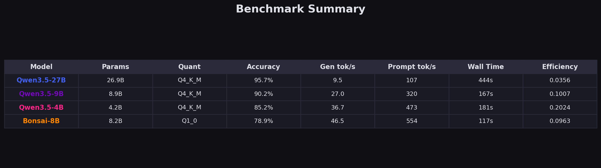

| Model | Accuracy | Gen tok/s | Prompt tok/s | Wall Time |
|-------|:--------:|:---------:|:------------:|:---------:|
| Qwen3.5-27B | **95.7%** | 9.5 | 107 | 444s |
| Qwen3.5-9B | 90.2% | 27.0 | 320 | 167s |
| Qwen3.5-4B | 85.2% | 36.7 | 473 | 181s |
| Bonsai-8B | 78.9% | **46.5** | **554** | **117s** |

### Overall Accuracy

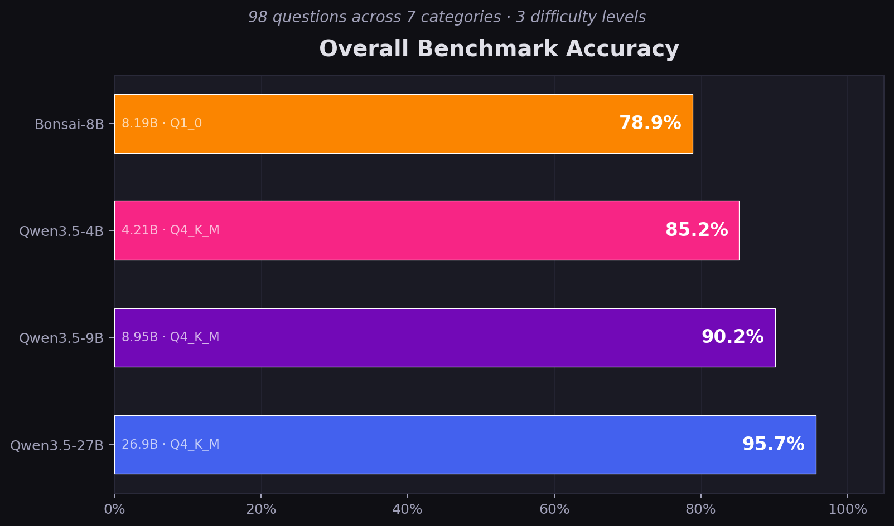

Qwen3.5-27B leads at 95.7%. Each step down in model size costs roughly 5 percentage points. Bonsai-8B, despite being 1-bit quantized, still reaches 78.9% — competitive given its 1.1 GiB weight footprint.

### Accuracy by Category

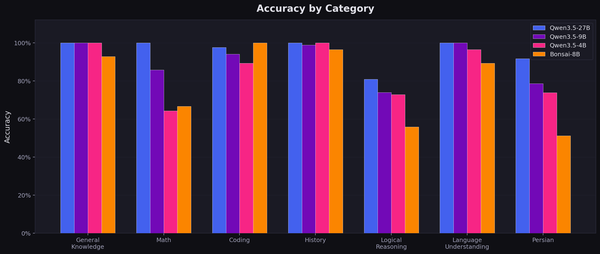

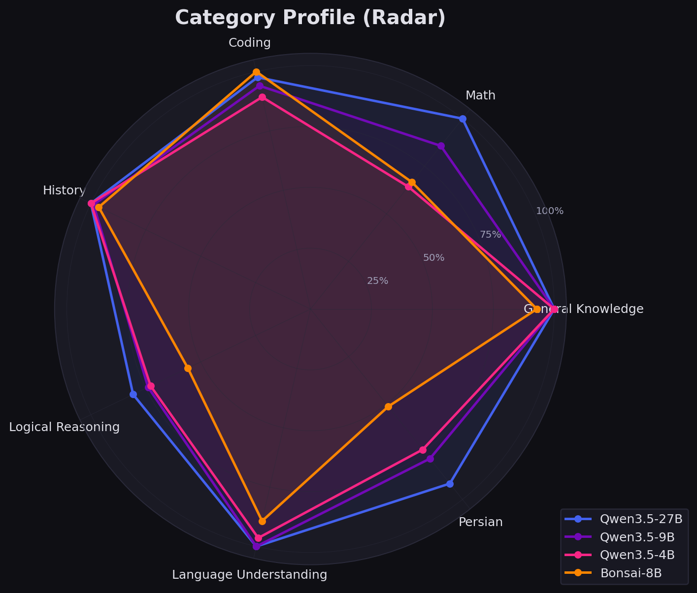

**Strong across all models:** General Knowledge, Coding, History, Language Understanding.

**Biggest differentiators:**
- **Logical Reasoning** — the hardest category overall. Qwen3.5-27B scores 80.8%, dropping to 55.9% for Bonsai-8B. Multi-step constraint puzzles and syllogisms are where parameter count matters most.
- **Persian** — Qwen3.5-27B (91.7%) vastly outperforms Bonsai-8B (51.2%). Multilingual capability degrades sharply with aggressive quantization.
- **Math** — Qwen3.5-27B achieves perfect 100%, while Bonsai-8B drops to 66.7%.

### Accuracy by Difficulty

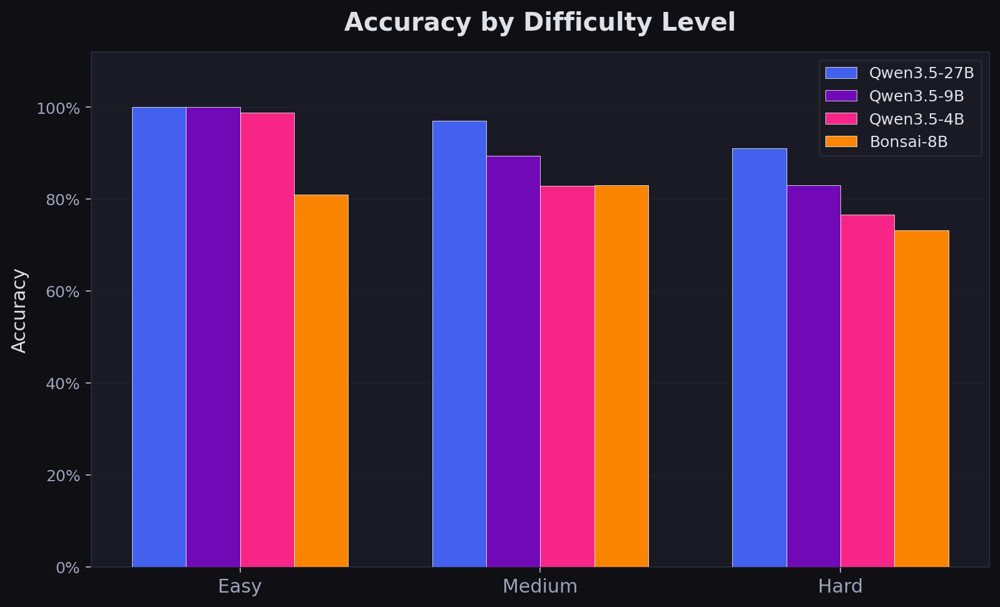

All models handle easy questions well (>90%). Hard questions expose the gap: Qwen3.5-27B stays above 90% while Bonsai-8B drops to ~60%.

### Accuracy vs. Speed

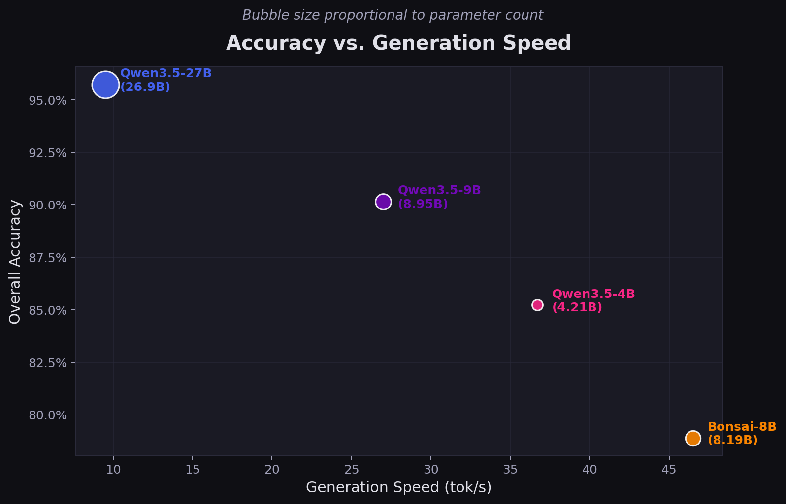

The classic accuracy-throughput tradeoff. Bonsai-8B generates at 46.5 tok/s (5x faster than Qwen3.5-27B) but sacrifices 17 percentage points of accuracy. Qwen3.5-9B hits a practical sweet spot: 90% accuracy at 27 tok/s.

### Speed Comparison

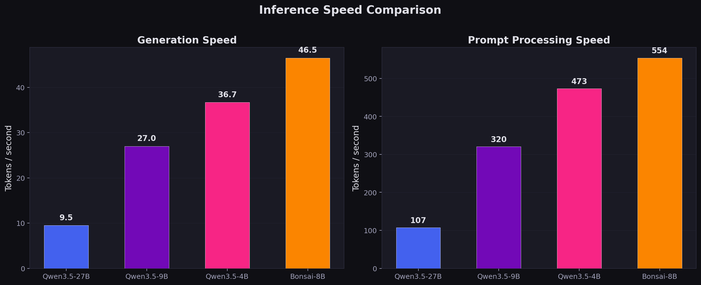

Generation speed is dominated by memory bandwidth on the Jetson's unified memory architecture. Smaller weight footprint = faster generation. Bonsai-8B's 1-bit weights make it the fastest despite having 8B parameters.

### Performance Details

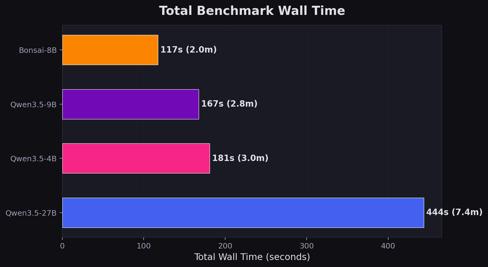

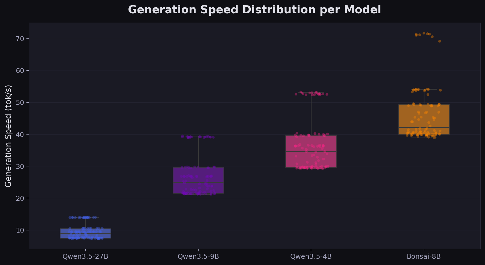

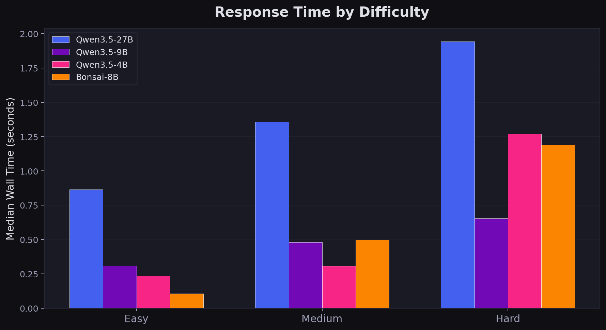

### Scaling Analysis

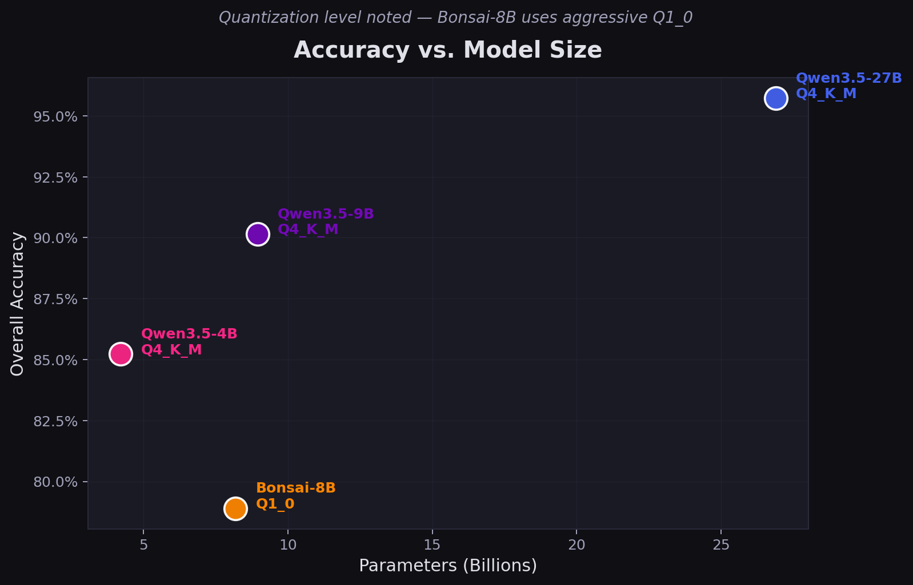

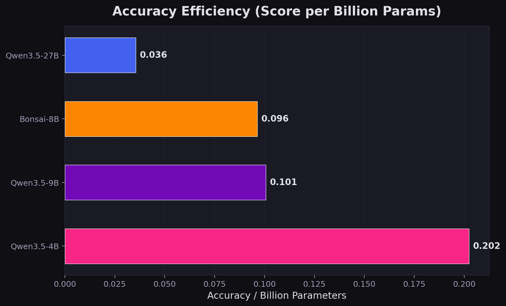

### Question-Level Analysis

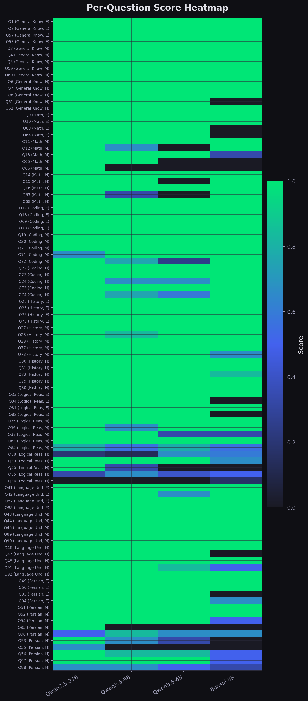

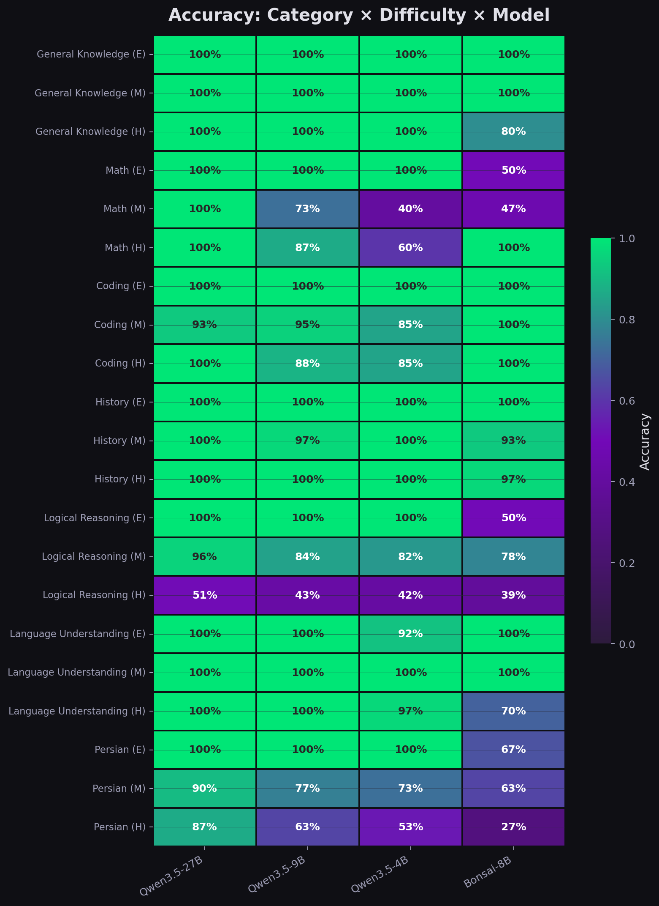

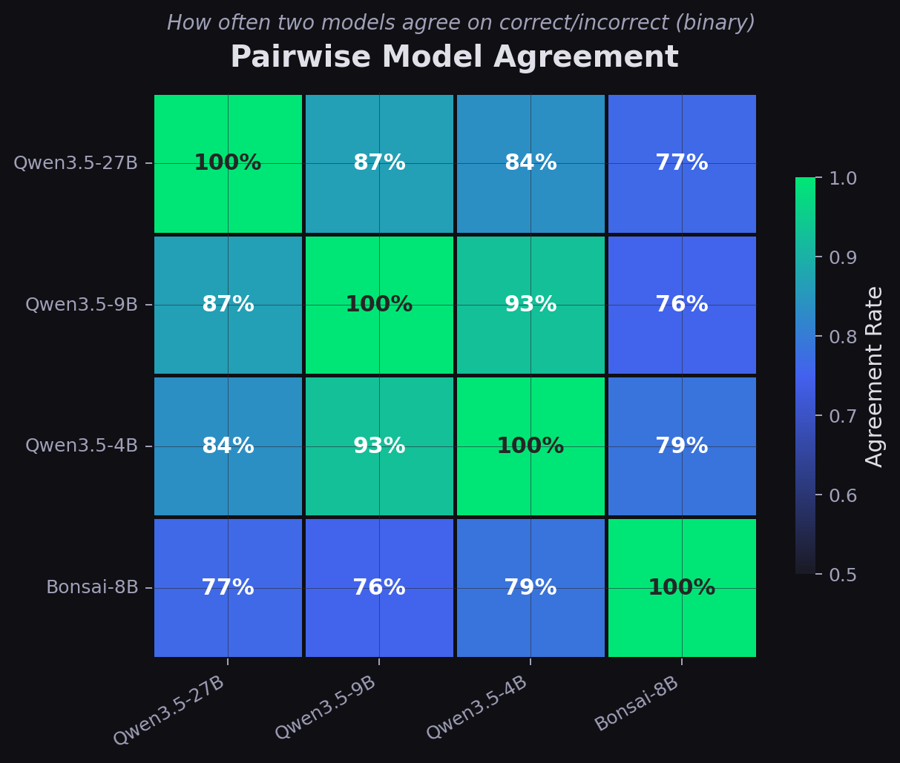

### Hardest Questions

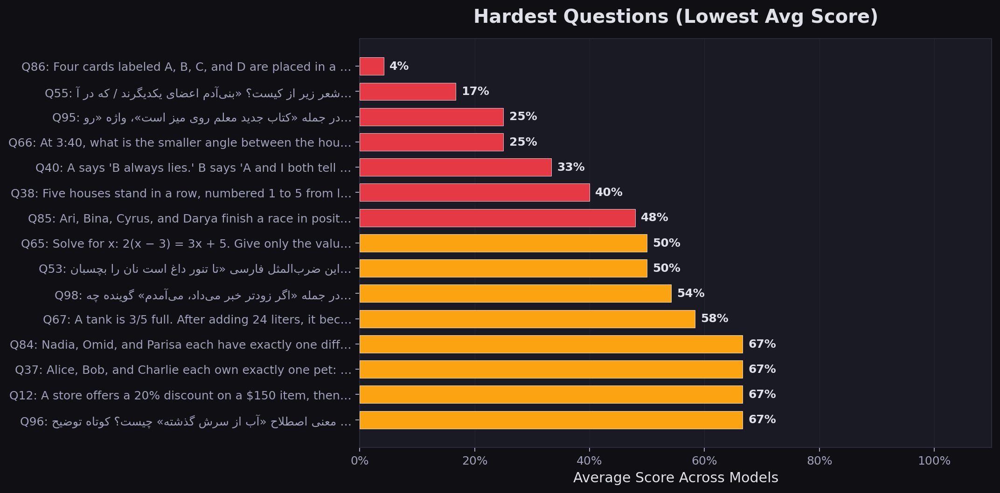

The hardest questions across all models are logic constraint puzzles (card ordering, clock angles, race ordering) and Persian language tasks. These require precise multi-step reasoning or strong multilingual knowledge — areas where smaller/more-quantized models struggle most.

### Verbosity

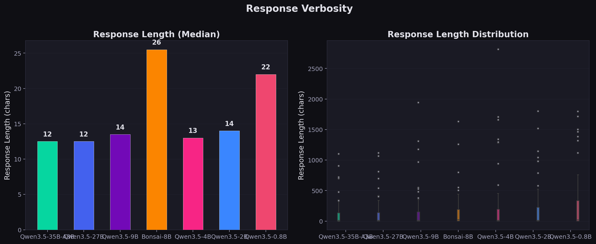

## Key Takeaways

1. **Qwen3.5-27B is the accuracy leader** at 95.7%, but at 9.5 tok/s it's the slowest. Best for tasks where correctness matters more than latency.

2. **Qwen3.5-9B is the best all-rounder** — 90% accuracy at 27 tok/s (3x faster than 27B). Handles most categories well with the notable exception of logical reasoning.

3. **Qwen3.5-4B punches above its weight** — 85% accuracy from only 2.5 GiB of weights. The hybrid Gated DeltaNet architecture keeps it competitive.

4. **Bonsai-8B trades accuracy for speed** — 1-bit quantization delivers 46.5 tok/s but costs 17 points of accuracy vs. the 27B. Weakest on Persian (51%) and logic (56%).

5. **Logical reasoning is the hardest category for all models.** Even the 27B only reaches 81%. This is where parameter count and quantization quality matter most.

6. **Coding is surprisingly robust** — all models score 89-100% on execution-graded code tasks. Code generation survives aggressive quantization better than reasoning or multilingual tasks.

7. **Persian degrades with quantization** — the 27B→Bonsai gap is 40 percentage points on Persian vs. 7 on General Knowledge. Multilingual capability is one of the first things lost.

## Running

```bash
# Run the benchmark (requires systemd services configured)
uv run llm_benchmark.py

# Generate analysis plots
uv run benchmark_eda.py
```

Requires passwordless sudo for `systemctl start/stop llama-server-*` (see `/etc/sudoers.d/llama-benchmark`).

## Hardware

- **Device:** NVIDIA Jetson Orin
- **Memory:** 30,696 MiB unified (shared CPU/GPU)
- **CPU:** 12 threads (ARM Cortex-A78AE)
- **GPU:** Ampere (compute capability 8.7)
- **Memory Bandwidth:** ~205 GB/s

## Author

Arman Jafarnezhad
